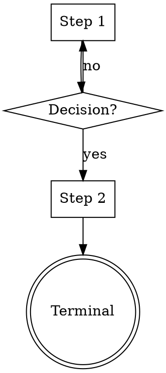

# Superpowers Plugin Structure Analysis

> Deep research into https://github.com/obra/superpowers — the reference Claude Code plugin implementation by Jesse Vincent. Version 4.3.0 analyzed on 2026-02-15.

## Table of Contents

1. [Overall Directory Structure](#1-overall-directory-structure)
2. [Plugin Manifest Files](#2-plugin-manifest-files)
3. [Skills Structure](#3-skills-structure)
4. [Commands Structure](#4-commands-structure)
5. [Agents Structure](#5-agents-structure)
6. [Hooks System](#6-hooks-system)
7. [CLAUDE.md Files](#7-claudemd-files)
8. [Library / Supporting Code](#8-library--supporting-code)
9. [Cross-Platform Support](#9-cross-platform-support)
10. [Key Patterns and Takeaways](#10-key-patterns-and-takeaways)

---

## 1. Overall Directory Structure

The superpowers repo is a **single-plugin repository** (not a monorepo marketplace). It serves as both the plugin source and, optionally, a marketplace entry point.

```
superpowers/                         # Repository root
├── .claude-plugin/                  # Plugin manifest directory
│   ├── plugin.json                  # Plugin metadata
│   └── marketplace.json             # Marketplace metadata (self-referencing)
├── skills/                          # All skills (flat namespace)
│   ├── brainstorming/
│   │   └── SKILL.md
│   ├── dispatching-parallel-agents/
│   │   └── SKILL.md
│   ├── executing-plans/
│   │   └── SKILL.md
│   ├── finishing-a-development-branch/
│   │   └── SKILL.md
│   ├── receiving-code-review/
│   │   └── SKILL.md
│   ├── requesting-code-review/
│   │   ├── SKILL.md
│   │   └── code-reviewer.md         # Template for code review agent
│   ├── subagent-driven-development/
│   │   ├── SKILL.md
│   │   ├── implementer-prompt.md     # Subagent prompt template
│   │   ├── spec-reviewer-prompt.md   # Subagent prompt template
│   │   └── code-quality-reviewer-prompt.md
│   ├── systematic-debugging/
│   │   ├── SKILL.md
│   │   ├── root-cause-tracing.md     # Supporting technique
│   │   ├── defense-in-depth.md       # Supporting technique
│   │   ├── condition-based-waiting.md
│   │   ├── condition-based-waiting-example.ts
│   │   ├── find-polluter.sh          # Utility script
│   │   ├── test-pressure-1.md        # Test scenarios
│   │   ├── test-pressure-2.md
│   │   ├── test-pressure-3.md
│   │   ├── test-academic.md
│   │   └── CREATION-LOG.md
│   ├── test-driven-development/
│   │   ├── SKILL.md
│   │   └── testing-anti-patterns.md  # Supporting reference
│   ├── using-git-worktrees/
│   │   └── SKILL.md
│   ├── using-superpowers/
│   │   └── SKILL.md                  # Bootstrap / meta skill
│   ├── verification-before-completion/
│   │   └── SKILL.md
│   ├── writing-plans/
│   │   └── SKILL.md
│   └── writing-skills/
│       ├── SKILL.md
│       ├── anthropic-best-practices.md  # Official Anthropic guidance
│       ├── persuasion-principles.md
│       ├── testing-skills-with-subagents.md
│       ├── render-graphs.js
│       ├── graphviz-conventions.dot
│       └── examples/
│           └── CLAUDE_MD_TESTING.md
├── commands/                        # Slash commands (thin wrappers)
│   ├── brainstorm.md
│   ├── write-plan.md
│   └── execute-plan.md
├── agents/                          # Agent definitions
│   └── code-reviewer.md
├── hooks/                           # Lifecycle hooks
│   ├── hooks.json                   # Hook configuration
│   ├── session-start.sh             # SessionStart hook script
│   └── run-hook.cmd                 # Deprecated polyglot wrapper
├── lib/                             # Shared library code
│   └── skills-core.js               # Skill discovery/parsing utilities
├── docs/                            # Documentation
│   ├── testing.md
│   ├── windows/
│   │   └── polyglot-hooks.md
│   ├── plans/
│   │   ├── 2025-11-28-skills-improvements-from-user-feedback.md
│   │   ├── 2025-11-22-opencode-support-implementation.md
│   │   └── 2025-11-22-opencode-support-design.md
│   ├── README.opencode.md
│   └── README.codex.md
├── tests/                           # Test infrastructure
│   ├── skill-triggering/            # Skill discovery tests
│   ├── explicit-skill-requests/     # Explicit invocation tests
│   ├── subagent-driven-dev/         # E2E workflow tests
│   ├── claude-code/                 # Integration tests
│   └── opencode/                    # OpenCode-specific tests
├── .opencode/                       # OpenCode platform support
│   ├── plugins/superpowers.js
│   └── INSTALL.md
├── .codex/                          # Codex platform support
│   └── INSTALL.md
├── README.md
├── RELEASE-NOTES.md
├── LICENSE
├── .gitignore
└── .gitattributes
```

### Key Observations

- **Flat skills namespace**: All skills live directly under `skills/` with no category subdirectories. Each skill is a directory containing `SKILL.md` plus optional supporting files.
- **No CLAUDE.md file exists** in the repo at all. The plugin injects context via hooks instead.
- **Single plugin, not a marketplace monorepo**: The `.claude-plugin/` directory is at the root, not inside a subdirectory.
- **Cross-platform**: Explicit support for Claude Code, OpenCode, and Codex via platform-specific directories (`.opencode/`, `.codex/`).

---

## 2. Plugin Manifest Files

### `.claude-plugin/plugin.json`

```json
{
  "name": "superpowers",
  "description": "Core skills library for Claude Code: TDD, debugging, collaboration patterns, and proven techniques",
  "version": "4.3.0",
  "author": {
    "name": "Jesse Vincent",
    "email": "jesse@fsck.com"
  },
  "homepage": "https://github.com/obra/superpowers",
  "repository": "https://github.com/obra/superpowers",
  "license": "MIT",
  "keywords": ["skills", "tdd", "debugging", "collaboration", "best-practices", "workflows"]
}
```

**Fields used:**
- `name` (string) - Plugin identifier
- `description` (string) - Human-readable description
- `version` (string) - Semantic version
- `author` (object) - `name` and `email`
- `homepage` (string) - URL
- `repository` (string) - Git URL
- `license` (string) - SPDX identifier
- `keywords` (array of strings) - Discovery tags

**Notable:** No `components`, `skills`, `commands`, `agents`, or `hooks` fields. Component registration appears to be **convention-based** (directory presence), not declared in plugin.json.

### `.claude-plugin/marketplace.json`

```json
{
  "name": "superpowers-dev",
  "description": "Development marketplace for Superpowers core skills library",
  "owner": {
    "name": "Jesse Vincent",
    "email": "jesse@fsck.com"
  },
  "plugins": [
    {
      "name": "superpowers",
      "description": "Core skills library for Claude Code: TDD, debugging, collaboration patterns, and proven techniques",
      "version": "4.3.0",
      "source": "./",
      "author": {
        "name": "Jesse Vincent",
        "email": "jesse@fsck.com"
      }
    }
  ]
}
```

**Fields used:**
- `name` (string) - Marketplace name (differs from plugin name, suffixed with `-dev`)
- `description` (string) - Marketplace description
- `owner` (object) - `name` and `email`
- `plugins` (array) - List of plugins in the marketplace
  - Each plugin: `name`, `description`, `version`, `source` (relative path), `author`

**Key insight:** The `source: "./"` means this marketplace references the same repo root as the plugin source. This is the pattern for a self-contained single-plugin marketplace.

---

## 3. Skills Structure

### Directory Layout

Every skill follows this pattern:

```
skills/
  skill-name/           # Lowercase kebab-case directory name
    SKILL.md            # Required: main skill file
    supporting-file.*   # Optional: reference docs, scripts, templates
```

**Naming conventions:**
- Directory names use lowercase kebab-case
- Gerund form preferred: `brainstorming`, `writing-plans`, `executing-plans`
- Active voice, verb-first: `dispatching-parallel-agents`, `requesting-code-review`
- The directory name matches the frontmatter `name` field exactly

### SKILL.md Frontmatter

Every SKILL.md has a YAML frontmatter block with exactly **two fields**:

```yaml
---
name: skill-name
description: Use when [specific triggering conditions]
---
```

**Frontmatter rules (from the writing-skills skill and Anthropic best practices):**
- **Only `name` and `description`** are supported fields
- **Max 1024 characters total** for frontmatter
- `name`: Letters, numbers, and hyphens only (no parentheses or special characters). Max 64 characters.
- `description`: Third person. Describes ONLY when to use it (not what it does). Start with "Use when..." to focus on triggering conditions. Max ~500 characters recommended, 1024 max.

**Critical pattern - The Description Trap:** Descriptions must NEVER summarize the skill's workflow. Testing revealed that when a description contains workflow details, Claude follows the description shortcut instead of reading the full SKILL.md body. Descriptions must be trigger-conditions only.

### Complete Frontmatter Examples from the Repo

```yaml
# brainstorming
---
name: brainstorming
description: "You MUST use this before any creative work - creating features, building components, adding functionality, or modifying behavior. Explores user intent, requirements and design before implementation."
---

# writing-plans
---
name: writing-plans
description: Use when you have a spec or requirements for a multi-step task, before touching code
---

# test-driven-development
---
name: test-driven-development
description: Use when implementing any feature or bugfix, before writing implementation code
---

# systematic-debugging
---
name: systematic-debugging
description: Use when encountering any bug, test failure, or unexpected behavior, before proposing fixes
---

# subagent-driven-development
---
name: subagent-driven-development
description: Use when executing implementation plans with independent tasks in the current session
---

# executing-plans
---
name: executing-plans
description: Use when you have a written implementation plan to execute in a separate session with review checkpoints
---

# dispatching-parallel-agents
---
name: dispatching-parallel-agents
description: Use when facing 2+ independent tasks that can be worked on without shared state or sequential dependencies
---

# requesting-code-review
---
name: requesting-code-review
description: Use when completing tasks, implementing major features, or before merging to verify work meets requirements
---

# receiving-code-review
---
name: receiving-code-review
description: Use when receiving code review feedback, before implementing suggestions, especially if feedback seems unclear or technically questionable - requires technical rigor and verification, not performative agreement or blind implementation
---

# verification-before-completion
---
name: verification-before-completion
description: Use when about to claim work is complete, fixed, or passing, before committing or creating PRs - requires running verification commands and confirming output before making any success claims; evidence before assertions always
---

# using-superpowers
---
name: using-superpowers
description: Use when starting any conversation - establishes how to find and use skills, requiring Skill tool invocation before ANY response including clarifying questions
---

# using-git-worktrees
---
name: using-git-worktrees
description: Use when starting feature work that needs isolation from current workspace or before executing implementation plans - creates isolated git worktrees with smart directory selection and safety verification
---

# finishing-a-development-branch
---
name: finishing-a-development-branch
description: Use when implementation is complete, all tests pass, and you need to decide how to integrate the work - guides completion of development work by presenting structured options for merge, PR, or cleanup
---

# writing-skills
---
name: writing-skills
description: Use when creating new skills, editing existing skills, or verifying skills work before deployment
---
```

### SKILL.md Body Structure

Every skill follows this general template:

```markdown
---
name: skill-name
description: Use when [specific triggering conditions]
---

# Skill Name (Title Case, Full Name)

## Overview
What is this? Core principle in 1-2 sentences.

## When to Use
[Inline DOT flowchart IF decision non-obvious]
Bullet list with SYMPTOMS and use cases
When NOT to use

## The Iron Law (for discipline skills)
```
NO [VIOLATION] WITHOUT [PRECONDITION] FIRST
```

## Core Pattern / The Process / Checklist
The actual instructions. May include:
- DOT/Graphviz flowcharts for process flows
- <Good>/<Bad> comparison blocks
- Code examples
- Step-by-step numbered lists
- Tables

## Common Rationalizations
| Excuse | Reality |
|--------|---------|
| ... | ... |

## Red Flags - STOP
List of thoughts that signal you're rationalizing

## Quick Reference
Table or bullets for scanning

## Common Mistakes
What goes wrong + fixes

## Integration
- **Called by:** other-skill
- **Pairs with:** other-skill
- **Required workflow skills:** list

## Real-World Impact (optional)
Concrete results from debugging sessions
```

### Supporting Files Pattern

Skills can include additional files alongside SKILL.md:

| Type | Example | Purpose |
|------|---------|---------|
| Reference docs | `testing-anti-patterns.md`, `root-cause-tracing.md` | Heavy reference material (100+ lines) |
| Prompt templates | `implementer-prompt.md`, `spec-reviewer-prompt.md` | Subagent dispatch templates |
| Utility scripts | `find-polluter.sh`, `render-graphs.js` | Reusable tools |
| Code examples | `condition-based-waiting-example.ts` | Working code to adapt |
| Test scenarios | `test-pressure-1.md` | Skill testing materials |
| Style guides | `graphviz-conventions.dot` | Convention references |

**Important:** Supporting files are loaded **on demand** via progressive disclosure. SKILL.md references them but Claude only reads them when needed.

### Cross-Referencing Between Skills

Skills reference each other using explicit requirement markers:

```markdown
**REQUIRED SUB-SKILL:** Use superpowers:test-driven-development
**REQUIRED BACKGROUND:** You MUST understand superpowers:systematic-debugging
**Complementary skills:** superpowers:verification-before-completion
```

**No `@` file references** between skills. The `@` syntax force-loads files immediately, consuming context. Instead, skills reference by name and let the Skill tool handle loading.

### DOT/Graphviz Flowcharts

Superpowers makes heavy use of inline DOT flowcharts as "executable specifications":

```markdown
## Process Flow


```

Flowcharts are used for:
- Non-obvious decision points
- Process loops where the agent might stop too early
- "When to use A vs B" decisions

They are NOT used for: reference material, code examples, linear instructions.

### Special XML Tags

Some skills use custom XML-like tags for emphasis:

```markdown
<HARD-GATE>
Do NOT invoke any implementation skill, write any code, scaffold any project,
or take any implementation action until you have presented a design and the
user has approved it.
</HARD-GATE>

<EXTREMELY-IMPORTANT>
If you think there is even a 1% chance a skill might apply, you ABSOLUTELY
MUST invoke the skill.
</EXTREMELY-IMPORTANT>

<Good>
[Positive example code]
</Good>

<Bad>
[Anti-pattern code]
</Bad>
```

---

## 4. Commands Structure

Commands are **thin wrappers** that redirect to skills. They live in the `commands/` directory as individual `.md` files.

### Command File Format

```markdown
---
description: "Human-readable description of what this command does"
disable-model-invocation: true
---

Invoke the superpowers:skill-name skill and follow it exactly as presented to you
```

### All Commands in the Repo

**`commands/brainstorm.md`**
```yaml
---
description: "You MUST use this before any creative work - creating features, building components, adding functionality, or modifying behavior. Explores requirements and design before implementation."
disable-model-invocation: true
---

Invoke the superpowers:brainstorming skill and follow it exactly as presented to you
```

**`commands/write-plan.md`**
```yaml
---
description: Create detailed implementation plan with bite-sized tasks
disable-model-invocation: true
---

Invoke the superpowers:writing-plans skill and follow it exactly as presented to you
```

**`commands/execute-plan.md`**
```yaml
---
description: Execute plan in batches with review checkpoints
disable-model-invocation: true
---

Invoke the superpowers:executing-plans skill and follow it exactly as presented to you
```

### Key Differences: Commands vs Skills

| Aspect | Command | Skill |
|--------|---------|-------|
| **Location** | `commands/` directory | `skills/` directory |
| **File** | Single `.md` file (named after slash command) | `SKILL.md` inside a named directory |
| **Frontmatter** | `description` + `disable-model-invocation` | `name` + `description` |
| **No `name` field** | Command name comes from filename | Skill name from frontmatter `name` |
| **Content** | 1-2 lines redirecting to a skill | Full instructions, process, examples |
| **Invocation** | User types `/superpowers:brainstorm` | Agent uses Skill tool or auto-triggers |
| **`disable-model-invocation`** | `true` = user-only, agent cannot call | N/A (skills are always agent-callable) |
| **Purpose** | Explicit user entry point | Reusable technique/process/reference |

**Design philosophy:** Commands are user-facing shortcuts. Skills are the actual content. Commands simply redirect to skills, keeping the content in one place.

---

## 5. Agents Structure

Agents live in the `agents/` directory as individual `.md` files.

### Agent File Format

```markdown
---
name: agent-name
description: |
  Detailed description with examples of when to use...
model: inherit
---

You are a [Role]. Your role is to [purpose].

[Detailed agent instructions...]
```

### The code-reviewer Agent

**`agents/code-reviewer.md`** (complete frontmatter):

```yaml
---
name: code-reviewer
description: |
  Use this agent when a major project step has been completed and needs to be reviewed against the original plan and coding standards. Examples: <example>Context: The user is creating a code-review agent that should be called after a logical chunk of code is written. user: "I've finished implementing the user authentication system as outlined in step 3 of our plan" assistant: "Great work! Now let me use the code-reviewer agent to review the implementation against our plan and coding standards" <commentary>Since a major project step has been completed, use the code-reviewer agent to validate the work against the plan and identify any issues.</commentary></example> <example>Context: User has completed a significant feature implementation. user: "The API endpoints for the task management system are now complete - that covers step 2 from our architecture document" assistant: "Excellent! Let me have the code-reviewer agent examine this implementation to ensure it aligns with our plan and follows best practices" <commentary>A numbered step from the planning document has been completed, so the code-reviewer agent should review the work.</commentary></example>
model: inherit
---
```

### Key Differences: Agents vs Skills vs Commands

| Aspect | Agent | Skill | Command |
|--------|-------|-------|---------|
| **Location** | `agents/` | `skills/skill-name/` | `commands/` |
| **File** | Single `.md` | `SKILL.md` + supporting | Single `.md` |
| **Frontmatter fields** | `name`, `description`, `model` | `name`, `description` | `description`, `disable-model-invocation` |
| **Has `model` field** | Yes (`inherit` or specific) | No | No |
| **Has `name` field** | Yes | Yes | No (name from filename) |
| **Content** | System prompt for a subagent | Instructions/reference | Redirect to skill |
| **Description style** | Includes `<example>` blocks with user/assistant turns | "Use when..." trigger-only | Simple description |
| **Purpose** | Define a specialized subagent persona | Teach a technique/process | User-facing shortcut |

**Important observation about agent descriptions:** The `code-reviewer` agent has a very long description that includes full `<example>` blocks with `<commentary>`. This is different from skills which keep descriptions short and trigger-only. Agent descriptions appear to use example-based matching to help Claude decide when to dispatch the agent.

---

## 6. Hooks System

### hooks.json

```json
{
  "hooks": {
    "SessionStart": [
      {
        "matcher": "startup|resume|clear|compact",
        "hooks": [
          {
            "type": "command",
            "command": "${CLAUDE_PLUGIN_ROOT}/hooks/session-start.sh",
            "async": false
          }
        ]
      }
    ]
  }
}
```

**Fields:**
- `hooks` (object) - Top-level container
  - `SessionStart` (array) - Hook event name, fires on session lifecycle events
    - `matcher` (string) - Regex matching event subtypes: `startup`, `resume`, `clear`, `compact`
    - `hooks` (array) - List of hook actions
      - `type`: `"command"` (runs a shell command)
      - `command`: Path to script. Uses `${CLAUDE_PLUGIN_ROOT}` variable for portability.
      - `async`: `false` = synchronous (blocks until complete). Was previously `true` but caused the hook to fail to inject context before the model's first turn.

### session-start.sh

The SessionStart hook does the following:

1. Checks for legacy skills directory (`~/.config/superpowers/skills`) and generates a warning if found
2. Reads the `using-superpowers` SKILL.md content
3. Escapes the content for JSON embedding (using fast bash parameter substitution, not character-by-character loop)
4. Outputs a JSON response that injects the skill content into the session context

**Output format:**

```json
{
  "hookSpecificOutput": {
    "hookEventName": "SessionStart",
    "additionalContext": "<EXTREMELY_IMPORTANT>\nYou have superpowers.\n\n**Below is the full content of your 'superpowers:using-superpowers' skill...**\n\n[using-superpowers SKILL.md content]\n</EXTREMELY_IMPORTANT>"
  }
}
```

**This is the bootstrap mechanism.** The `using-superpowers` skill is injected directly into the session context at startup, wrapping it in `<EXTREMELY_IMPORTANT>` tags. This skill then instructs the agent to use the Skill tool for all other skills.

### Key Hook Design Decisions

- **Only one hook** is defined: `SessionStart`
- **Only one skill is preloaded**: `using-superpowers` (the meta-skill that teaches skill usage)
- **All other skills** are loaded on demand via the Skill tool
- **Synchronous execution** (`async: false`) is critical -- async execution caused the context to not be available for the first message

---

## 7. CLAUDE.md Files

**There are NO CLAUDE.md files** in the superpowers repository. Not at the root, not in any subdirectory.

Instead of CLAUDE.md, superpowers uses the **SessionStart hook** to inject context. The `using-superpowers` skill serves as the equivalent of what a CLAUDE.md would contain -- it establishes the behavioral framework for the session.

This is a deliberate architectural choice. The hook approach ensures the context is injected with `<EXTREMELY_IMPORTANT>` wrapper tags for maximum compliance, and it can include dynamic elements (like the legacy migration warning).

---

## 8. Library / Supporting Code

### `lib/skills-core.js`

A shared ES module providing skill discovery and parsing utilities. Used by the OpenCode plugin and potentially by other integrations.

**Exported functions:**

| Function | Purpose |
|----------|---------|
| `extractFrontmatter(filePath)` | Parse YAML frontmatter from a SKILL.md file. Returns `{name, description}` |
| `findSkillsInDir(dir, sourceType, maxDepth)` | Recursively find all SKILL.md files in a directory. Returns array of skill objects |
| `resolveSkillPath(skillName, superpowersDir, personalDir)` | Resolve a skill name to its file path with shadowing (personal overrides superpowers) |
| `checkForUpdates(repoDir)` | Check if git repo has updates available (3s timeout) |
| `stripFrontmatter(content)` | Remove YAML frontmatter from content, returning body only |

**Skill resolution supports namespacing:**
- `superpowers:brainstorming` - Forces superpowers namespace
- `brainstorming` - Tries personal first, then superpowers

**Three-tier skill priority:** Project > Personal > Superpowers

---

## 9. Cross-Platform Support

### Claude Code
- Primary platform
- Plugin installed via marketplace: `/plugin marketplace add obra/superpowers-marketplace`
- Skills discovered natively from `skills/` directory
- Commands from `commands/` directory
- Agents from `agents/` directory
- Hooks from `hooks/hooks.json`

### OpenCode (`.opencode/`)
- JavaScript plugin at `.opencode/plugins/superpowers.js`
- Uses `experimental.chat.system.transform` hook to inject bootstrap context
- Skills symlinked to `~/.config/opencode/skills/superpowers/`
- Tool mapping: `TodoWrite` -> `update_plan`, `Task` -> `@mention`, `Skill` -> native `skill` tool

### Codex (`.codex/`)
- Skills symlinked to `~/.agents/skills/superpowers/`
- Native skill discovery (no bootstrap CLI needed since v4.2.0)
- Clone + symlink installation

### Windows
- `.gitattributes` enforces LF line endings for `.sh`, `.cmd`, `.md`, `.json`, `.js`, `.ts` files
- Deprecated polyglot wrapper (`run-hook.cmd`) for pre-2.1.x Claude Code
- Claude Code 2.1.x auto-detects `.sh` files and prepends `bash` on Windows

---

## 10. Key Patterns and Takeaways

### Pattern 1: Convention Over Configuration

Components are discovered by directory convention, not declared in plugin.json:
- `skills/` -> skill directories containing `SKILL.md`
- `commands/` -> command `.md` files
- `agents/` -> agent `.md` files
- `hooks/hooks.json` -> hook definitions

The `plugin.json` contains only metadata (name, version, author), not a component registry.

### Pattern 2: Skills Are the Core, Everything Else Redirects

- Commands are 1-2 line redirects to skills
- The SessionStart hook preloads exactly one skill (`using-superpowers`)
- That meta-skill teaches the agent to use the Skill tool for everything else
- Agent definitions are used by skills (the `code-reviewer` agent is dispatched by the `requesting-code-review` skill)

### Pattern 3: Flat Namespace for Skills

All 14 skills live directly under `skills/` with no categorization subdirectories. The skill description handles discoverability. This avoids path complexity and makes skill resolution simple.

### Pattern 4: Frontmatter Minimalism

Only two fields in skill frontmatter: `name` and `description`. No tags, no categories, no version, no dependencies. The `name` field matches the directory name. The `description` drives all discovery.

### Pattern 5: Description as Trigger, Not Summary

The single most important design lesson: skill descriptions must describe WHEN to use the skill (trigger conditions), never WHAT the skill does (workflow summary). Workflow summaries in descriptions cause Claude to shortcut the actual skill content.

### Pattern 6: Hooks for Bootstrap Only

The hook system is used minimally -- a single `SessionStart` hook that preloads the meta-skill. All other context loading happens dynamically through skill invocation.

### Pattern 7: Progressive Disclosure via Supporting Files

SKILL.md is the entry point. Supporting files (reference docs, prompt templates, scripts) are kept alongside and loaded only when needed. This keeps initial token cost low while allowing deep reference material.

### Pattern 8: Commands Have `disable-model-invocation: true`

All three commands use `disable-model-invocation: true`, meaning only users can invoke them (via `/superpowers:command-name`). The underlying skills remain agent-callable. This prevents confusion where Claude would invoke a command that just redirects to a skill.

### Pattern 9: Agent Descriptions Use Example Blocks

Unlike skills (which use "Use when..." descriptions), agent descriptions include full `<example>` blocks with user/assistant conversation turns and `<commentary>`. This helps Claude match situations where the agent should be dispatched.

### Pattern 10: Semantic Versioning with Release Notes

The plugin uses strict semver (currently 4.3.0) with detailed `RELEASE-NOTES.md`. Version is maintained in both `plugin.json` and `marketplace.json`.

### Complete Skills Inventory (14 skills)

| Skill | Supporting Files | Purpose |
|-------|-----------------|---------|
| `brainstorming` | none | Design before implementation |
| `writing-plans` | none | Implementation planning |
| `executing-plans` | none | Batch execution with checkpoints |
| `subagent-driven-development` | 3 prompt templates | Fresh subagent per task |
| `dispatching-parallel-agents` | none | Concurrent independent work |
| `test-driven-development` | 1 reference | RED-GREEN-REFACTOR |
| `systematic-debugging` | 3 techniques, 1 script, 4 tests | Root cause investigation |
| `requesting-code-review` | 1 template | Pre-review checklist |
| `receiving-code-review` | none | Handling review feedback |
| `verification-before-completion` | none | Evidence before claims |
| `using-git-worktrees` | none | Isolated workspaces |
| `finishing-a-development-branch` | none | Merge/PR/discard workflow |
| `using-superpowers` | none | Meta: how to use skills |
| `writing-skills` | 5 supporting files | Meta: how to create skills |

### Token Efficiency Guidelines

From the `writing-skills` skill and Anthropic best practices:
- Getting-started/frequently-loaded skills: <150 words each
- Frequently-loaded skills: <200 words total
- Other skills: <500 words
- SKILL.md body: under 500 lines
- Move details to supporting files when approaching limits
- Use `--help` references instead of documenting all flags
- Cross-reference other skills instead of repeating content
- Compress examples to minimal form

---

## Appendix: File-by-File Reference

### All Files Read During Analysis

| File | Type | Key Content |
|------|------|-------------|
| `.claude-plugin/plugin.json` | Manifest | name, version, author, keywords |
| `.claude-plugin/marketplace.json` | Manifest | Self-referencing marketplace with source="./" |
| `hooks/hooks.json` | Config | SessionStart hook definition |
| `hooks/session-start.sh` | Script | Bootstrap: injects using-superpowers into context |
| `hooks/run-hook.cmd` | Script | Deprecated polyglot Windows wrapper |
| `lib/skills-core.js` | Library | Frontmatter parsing, skill discovery, resolution |
| `commands/brainstorm.md` | Command | Redirects to brainstorming skill |
| `commands/write-plan.md` | Command | Redirects to writing-plans skill |
| `commands/execute-plan.md` | Command | Redirects to executing-plans skill |
| `agents/code-reviewer.md` | Agent | Subagent definition with example-based description |
| `skills/*/SKILL.md` | Skills | 14 skill definitions (all read in full) |
| `skills/subagent-driven-development/*.md` | Templates | 3 subagent prompt templates |
| `skills/requesting-code-review/code-reviewer.md` | Template | Code review template with placeholders |
| `skills/systematic-debugging/root-cause-tracing.md` | Reference | Supporting technique |
| `skills/writing-skills/anthropic-best-practices.md` | Reference | Official Anthropic skill authoring guide |
| `.opencode/plugins/superpowers.js` | Plugin | OpenCode platform integration |
| `.opencode/INSTALL.md` | Docs | OpenCode installation guide |
| `.codex/INSTALL.md` | Docs | Codex installation guide |
| `README.md` | Docs | Project overview and installation |
| `RELEASE-NOTES.md` | Docs | Full version history (v1.x through v4.3.0) |
| `.gitignore` | Config | Ignores .worktrees/, .private-journal/, .claude/ |
| `.gitattributes` | Config | LF line endings for scripts and text files |
